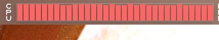
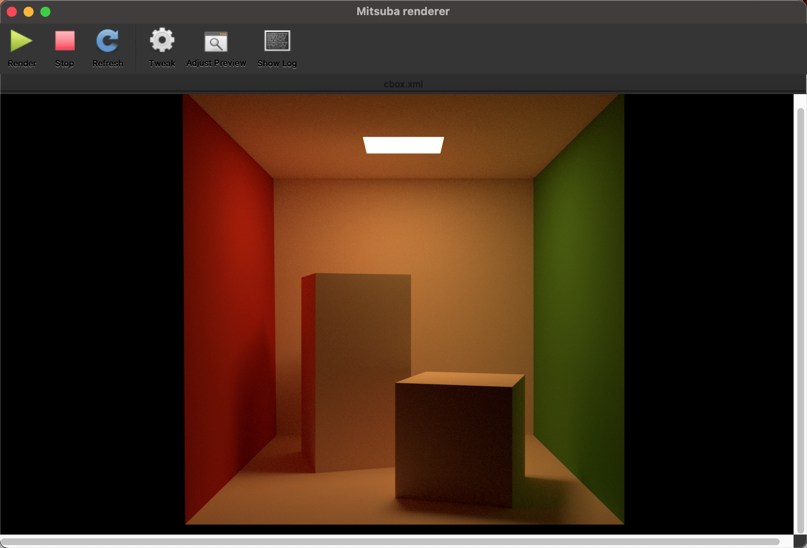

# Install Mitsuba Renderer on macOS Big Sur

This document provides my working process of **installing the latest Mitsuba renderer 0.6.0 on macOS with Anaconda**. 

I have borrowed some ideas from https://github.com/ShilinC/Mitsuba_Install_MacOS. Thank for his works!

**The latest Mitsuba version is 0.6.0 on GitHub, which has not been put on the official website**.

GitHub: https://github.com/mitsuba-renderer/mitsuba.git

Official Website: https://www.mitsuba-renderer.org/download.html

# Operating System

**MacOS Big Sur (Version 11.4)**

# Preparation

**A clean Python 2.7 environment** (I use Anaconda to create), and make sure that **the default python is 2.7 instead of 3.5/3.6, since Mitsuba source file is written in Python2**.

```bash
$conda create -n mitsuba_py27 python=2.7
$source activate mitsuba_py27
```

**Installing the build system**: Scons: > 2.0.0 (I use v2.5.1) 

```bash
$pip install SCons
```
or 
```bash
$conda install -c anaconda scons
```

XCode (V12.5.1) and Xcode Command Line Tools (V10.13)

To install command line tools, open XCode: File -> Open Develop Tool -> More develop tools and install the correct version.

The macOS SDK can be download from there: https://github.com/phracker/MacOSX-SDKs

**Important !!!**

I found the standalone Toolchain makes some errors (can not compile iostream), **please switch the Xcode to the developer tools rather than the CommandLineTools**

```bash
$sudo xcode-select -s /Applications/Xcode.app/Contents/Developer
```

We can check by below command:

```bash
$xcode-select -p
/Applications/Xcode.app/Contents/Developer
```

# Installation and Compilation

1. **Clone Mitsuba 0.6.0 Repo**:
```bash
$git clone --recursive https://github.com/mitsuba-renderer/mitsuba.git
```
2. **In the root directory of /mitsuba folder, clone Mitsuba dependencies V0.6.0 for Mac OS**:
```bash
$git clone https://github.com/mitsuba-renderer/dependencies_macos.git
```
**Note: Do NOT use the link provided in official Mitsuba manual for dependencies**, which is:

```bash
$hg clone https://www.mitsuba-renderer.org/hg/dependencies_macos
```
**Since this will download dependencies V0.5.0** which will encounter an incompatible error with Mitsuba V0.6.0.

The cloned dependencies should be in the /mitsuba root directory.

3. **Change the name of independency folders**
```bash
$mv dependencies_macos dependencies
```

4. **Copy /mitsuba/build/config-macos10.12-clang-x86_64.py configuration file into the root /mitsuba directory**:
```bash
$cp ./build/config-macos10.12-clang-x86_64.py config.py
```

5. **Open config.py and change the Mac OS SDK path from**:

```bash
'/Applications/Xcode.app/Contents/Developer/Platforms/MacOSX.platform/Developer/SDKs/MacOSX10.12.sdk'
```
to
```bash
'/Applications/Xcode.app/Contents/Developer/Platforms/MacOSX.platform/Developer/SDKs/MacOSX.sdk'
```
Note that **there are two changes of this path should be made in CCFLAGS and LINKFLAGS**.

6. I have met an error that can not read the version of dependences (error: expected unqualified-id). **I delete the 'version' file in the dependencies directory and then close the dependencies version check by editing the 'build/SConscript.configure'**:

```bash
add 'versionMismatch = False' at line 294 to close the check
```
7. **Now we can compile by run 'scons':**

```bash
$scons
```

It will take several minutes to finish.

8. **To run the renderer from the command line**:

```bash
source setpath.sh
```

Now you will see **Mitsuba application icon in /mitsuba root directory. Move it to 'Application' directory**. 

9. **Start rendering with example scenes**

   - It support **multi-threads**

   

    **Cbox scene**

   <center>
	  
   </center>


